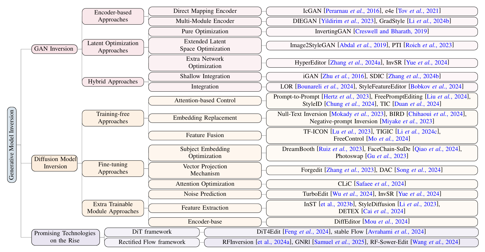

  <h1 align="center">Image Inversion: A Survey from GANs to Diffusion and Beyond</h1>
  

    <a href="https://scholar.google.com.hk/citations?user=-WKfgd0AAAAJ&hl=zh-CN"><strong>Yinan Chen 1</strong></a>
    .
    <a href="https://zhangzjn.github.io/"><strong>Jiangning Zhang 1,2</strong></a>
    .
    <a href="https://scholar.google.com/citations?user=8V6O60gAAAAJ&hl=en"><strong>Yali Bi 3</strong></a>
    .
    <a href="https://huuxiaobin.github.io/"><strong>Xiaobin Hu 2</strong></a>
    .
    <a href="https://scholar.google.cz/citations?user=Jm5qsAYAAAAJ&hl=zh-CN&authuser=1"><strong>Teng Hu 4</strong></a>
    .
     <a href="https://scholar.google.com/citations?hl=zh-CN&user=m3KDreEAAAAJ"><strong>Zhucun Xue 1</strong></a>
    .
    <a href="https://yiranran.github.io/"><strong>Ran Yi 4</strong></a>
    .
    <a href="https://scholar.google.com/citations?user=qYcgBbEAAAAJ"><strong>Yong Liu 1</strong></a>
    .
    <a href="https://tyshiwo.github.io/"><strong>Ying Tai 5</strong></a>

    <strong>1College of Control Science and Engineering, Zhejiang University</strong> &nbsp;&nbsp;&nbsp; 
    <strong>2YouTu Lab, Tencent</strong> &nbsp;&nbsp;&nbsp; 
    <strong>3College of Computer and Information Science, Southwest University</strong>
     
    <strong>4Department of Computer Science & Engineering, Shanghai Jiao Tong University</strong> &nbsp;&nbsp;&nbsp;
    <strong>5School of Intelligence Science and Technology, Nanjing University</strong>

# Introduction

This repository is a comprehensive collection of resources for **Image Inversion**, covering techniques from **GANs** to **diffusion models**, and emerging frameworks like **DiT** and **rectified flow**. It categorizes methods, highlights advancements, and supports mainstream applications such as object editing, attribute editing, style transfer, image restoration, and personalized generation. And it alse organized resources on Generative Model Inversion applied to **other domains**. If you find any work missing or have any suggestions, feel free to pull requests.

## Survey pipeline

# Summary of Contents

- [Introduction](#introduction)
- [Summary of Contents](#summary-of-contents)
- [Image Inversion Methods](#Image-Inversion-Methods)
  - [Diffusion Model](#Diffusion-Model)
    - [Training-free](#Training-free)
    - [Fine-tune](#Fine-tune)
    - [Extra Trainable Module](#Extra-Trainable-Module)
  - [GANs](#GANs)
    - [Encoder-based](#Encoder-based) 
    - [Latent Optimization](#Latent-Optimization)
    - [Hybrid](#Hybrid)
  - [Promising Technologies](#Promising-Technologies)
    - [DiT](#DiT)
    - [Rectified Flow](Rectified-Flow)
- [Related Research Domains](#Related-Research-Domains)
  - [Video](#Video)
  - [3D](#3D)
  - [Audio](#Audio)
# Image Inversion Methods

## Diffusion Model

### Training-free

| Year | Venue    | Task                          | Paper Title                                                  | Code                                                         |
| ---- | -------- | ----------------------------- | ------------------------------------------------------------ | ------------------------------------------------------------ |
| 2025 | AAAI     | Spatial-Aware Editing         | [DesignEdit: Multi-Layered Latent Decomposition and Fusion for Unified & Accurate Image Editing](https://arxiv.org/abs/2403.14487) | [Code](https://github.com/design-edit/DesignEdit)            |
| 2024 | CVPR     | Object & Attribute Editing    | [An Edit Friendly DDPM Noise Space: Inversion and Manipulations](https://arxiv.org/abs/2304.06140) | [Code](https://github.com/inbarhub/DDPM_inversion)           |
| 2024 | NN       | Object & Attribute Editing    | [PFB-Diff: Progressive Feature Blending Diffusion for Text-driven Image Editing](https://arxiv.org/abs/2306.16894) | [Code](https://github.com/CMACH508/PFB-Diff)                 |
| 2024 | NIPS     | Object & Attribute Editing    | [Energy-Based Cross Attention for Bayesian Context Update in Text-to-Image Diffusion Models](https://arxiv.org/abs/2306.09869) | [Code](https://github.com/EnergyAttention/Energy-Based-CrossAttention) |
| 2024 | WACV     | Object & Attribute Editing    | [ProxEdit: Improving Tuning-Free Real Image Editing with Proximal Guidance](https://arxiv.org/pdf/2306.05414) | [Code](https://github.com/phymhan/prompt-to-prompt)          |
| 2024 | ECCV     | Object & Attribute Editing    | [Exact Diffusion Inversion via Bi-directional Integration Approximation](https://arxiv.org/abs/2307.10829) | [Code](https://github.com/guoqiang-zhang-x/BDIA)             |
| 2024 | ICLR     | Object & Attribute Editing    | [Magicremover: Tuning-free Text-guided Image inpainting with Diffusion Models](https://arxiv.org/abs/2310.02848) | -                                                            |
| 2024 | ICLR     | Object & Attribute Editing    | [PnP Inversion: Boosting Diffusion-based Editing with 3 Lines of Code](https://arxiv.org/abs/2310.01506) | [Code](https://github.com/cure-lab/PnPInversion)             |
| 2024 | ICLR     | Object & Attribute Editing    | [Object-aware Inversion and Reassembly for Image Editing](https://arxiv.org/abs/2310.12149) | [Code](https://github.com/aim-uofa/OIR)                      |
| 2024 | CVPR     | Object & Attribute Editing    | [LEDITS++: Limitless Image Editing using Text-to-Image Models](https://arxiv.org/abs/2311.16711) | [Code](https://github.com/ml-research/ledits_pp)             |
| 2024 | CVPR     | Object & Attribute Editing    | [Contrastive Denoising Score for Text-guided Latent Diffusion Image Editing](https://arxiv.org/abs/2311.18608) | [Code](https://github.com/HyelinNAM/ContrastiveDenoisingScore) |
| 2024 | CVPR     | Object & Attribute Editing    | [Focus on Your Instruction: Fine-grained and Multi-instruction Image Editing by Attention Modulation](https://arxiv.org/abs/2312.10113) | [Code](https://github.com/guoqincode/Focus-on-Your-Instruction) |
| 2024 | ICLR     | Object & Attribute Editing    | [Noise Map Guidance: Inversion with Spatial Context for Real Image Editing](https://arxiv.org/abs/2402.04625) | [Code](https://github.com/hansam95/NMG)                      |
| 2024 | CVPR     | Object & Attribute Editing    | [Towards Understanding Cross and Self-Attention in Stable Diffusion for Text-Guided Image Editing](https://arxiv.org/abs/2403.03431) | [Code](https://github.com/alibaba/EasyNLP/tree/master/diffusion/FreePromptEditing) |
| 2024 | Arxiv    | Object & Attribute Editing    | [Ground-A-Score: Scaling Up the Score Distillation for Multi-Attribute Editing](https://arxiv.org/abs/2403.13551) | [Code](https://github.com/Ground-A-Score/Ground-A-Score/)    |
| 2024 | ACM MM   | Object & Attribute Editing    | [LoMOE: Localized Multi-Object Editing via Multi-Diffusion](https://arxiv.org/abs/2403.00437) | [Code](https://github.com/goirik-chakrabarty/LoMOE)          |
| 2024 | ICLR     | Spatial-Aware Editing         | [DragonDiffusion: Enabling Drag-style Manipulation on Diffusion Models](https://arxiv.org/abs/2307.02421) | [Code](https://github.com/MC-E/DragonDiffusion)              |
| 2024 | CVPR     | Style Transfer                | [Z∗: Zero-shot Style Transfer via Attention Rearrangement](https://arxiv.org/abs/2311.16491) | [Code](https://github.com/HolmesShuan/Zero-shot-Style-Transfer-via-Attention-Rearrangement) |
| 2024 | CVPR     | Style Transfer                | [Style Injection in Diffusion: A Training-free Approach for Adapting Large-scale Diffusion Models for Style Transfer](https://arxiv.org/abs/2312.09008) | [Code](https://github.com/jiwoogit/StyleID)                  |
| 2024 | CVPR     | Controllable Image Generation | [FreeControl: Training-Free Spatial Control of Any Text-to-Image Diffusion Model with Any Condition](https://arxiv.org/abs/2312.07536) | [Code](https://github.com/genforce/freecontrol)              |
| 2024 | FG       | Object & Attribute Editing    | [Discovering Interpretable Directions in the Semantic Latent Space of Diffusion Models](https://arxiv.org/abs/2303.11073) | [Code](https://github.com/renhaa/semantic-diffusion)         |
| 2024 | NIPS     | Image Restoration             | [Blind Image Restoration via Fast Diffusion Inversion](https://arxiv.org/abs/2405.19572) | [Code](https://github.com/hamadichihaoui/BIRD)               |
| 2024 | SIGGRAPH | Image Fusion                  | [Cross-Image Attention for Zero-Shot Appearance Transfer](https://arxiv.org/abs/2311.03335) | [Code](https://github.com/garibida/cross-image-attention)    |
| 2024 | ECCV     | Image Fusion                  | [Tuning-Free Image Customization with Image and Text Guidance](https://arxiv.org/abs/2403.12658) | [Code](https://github.com/zrealli/TIGIC)                     |
| 2024 | CVPR     | Image Generation              | [Self-Discovering Interpretable Diffusion Latent Directions for Responsible Text-to-Image Generation.](https://arxiv.org/abs/2311.17216) | [Code](https://github.com/hangligit/InterpretDiffusion)      |
| 2024 | ACM MM   | Personalized Generation       | [Pick-and-Draw: Training-free Semantic Guidance for Text-to-Image Personalization](https://arxiv.org/abs/2401.16762) | -                                                            |
| 2024 | CVPR     | Personalized Generation       | [DreamMatcher: Appearance Matching Self-Attention for Semantically-Consistent Text-to-Image Personalization](https://arxiv.org/abs/2402.09812) | [Code](https://github.com/cvlab-kaist/DreamMatcher)          |
| 2023 | ICLR     | Object & Attribute Editing    | [Prompt-to-Prompt Image Editing with Cross Attention Control](https://arxiv.org/abs/2208.01626) | [Code](https://github.com/google/prompt-to-prompt/)          |
| 2023 | ICLR     | Object & Attribute Editing    | [DiffEdit: Diffusion-based semantic image editing with mask guidance](https://arxiv.org/abs/2210.11427) | -                                                            |
| 2023 | CVPR     | Object & Attribute Editing    | [Null-text Inversion for Editing Real Images using Guided Diffusion Models](https://arxiv.org/abs/2211.09794) | [Code](https://github.com/google/prompt-to-prompt/#null-text-inversion-for-editing-real-images) |
| 2023 | CVPR     | Object & Attribute Editing    | [EDICT: Exact Diffusion Inversion via Coupled Transformations](https://arxiv.org/abs/2211.12446) | [Code](https://github.com/salesforce/EDICT)                  |
| 2023 | CVPR     | Object & Attribute Editing    | [Plug-and-Play Diffusion Features for Text-Driven Image-to-Image Translation](https://arxiv.org/abs/2211.12572) | [Code](https://github.com/MichalGeyer/plug-and-play)         |
| 2023 | CVPR     | Object & Attribute Editing    | [Uncovering the Disentanglement Capability in Text-to-Image Diffusion Models](https://arxiv.org/abs/2212.08698) | [Code](https://github.com/UCSB-NLP-Chang/DiffusionDisentanglement) |
| 2023 | Arxiv    | Object & Attribute Editing    | [Negative-prompt Inversion: Fast Image Inversion for Editing with Text-guided Diffusion Models](https://arxiv.org/abs/2305.16807) | -                                                            |
| 2023 | ICCV     | Object & Attribute Editing    | [Prompt Tuning Inversion for Text-Driven Image Editing Using Diffusion Models](https://arxiv.org/abs/2305.04441) | [Code](https://github.com/XiruiTeng/prompt-tuning-inversion) |
| 2023 | Arxiv    | Object & Attribute Editing    | [LEDITS: Real Image Editing with DDPM Inversion and Semantic Guidance](https://arxiv.org/abs/2307.00522) | [Code](https://github.com/camenduru/ledits-hf)               |
| 2023 | ICCV     | Object & Attribute Editing    | [Effective Real Image Editing with Accelerated Iterative Diffusion Inversion](https://arxiv.org/abs/2309.04907) | -                                                            |
| 2023 | NIPS     | Object & Attribute Editing    | [Dynamic Prompt Learning: Addressing Cross-Attention Leakage for Text-Based Image Editing](https://arxiv.org/abs/2309.15664) | [Code](https://github.com/wangkai930418/DPL)                 |
| 2023 | Arxiv    | Object & Attribute Editing    | [Fixed-point Inversion for Text-to-image diffusion models](https://arxiv.org/abs/2312.12540v1) | [Code](https://github.com/dvirsamuel/FPI)                    |
| 2023 | ICCV     | Attribute Editing             | [Localizing Object-level Shape Variations with Text-to-Image Diffusion Models](https://arxiv.org/abs/2303.11306) | [Code](https://github.com/orpatashnik/local-prompt-mixing)   |
| 2023 | ICCV     | Attribute Editing             | [MasaCtrl: Tuning-Free Mutual Self-Attention Control for Consistent Image Synthesis and Editing](https://arxiv.org/abs/2304.08465) | [Code](https://github.com/TencentARC/MasaCtrl)               |
| 2023 | PRCV     | Attribute Editing             | [KV Inversion: KV Embeddings Learning for Text-Conditioned Real Image Action Editing](https://arxiv.org/abs/2309.16608) | -                                                            |
| 2023 | AAAI     | Attribute Editing             | [Tuning-Free Inversion-Enhanced Control for Consistent Image Editing](https://arxiv.org/abs/2312.14611) | -                                                            |
| 2023 | TOG      | Image Restoration             | [Blended Latent Diffusion](https://arxiv.org/abs/2206.02779) | [Code](https://github.com/omriav/blended-latent-diffusion)   |
| 2023 | Arxiv    | Image Restoration             | [Differential Diffusion: Giving Each Pixel Its Strength](https://arxiv.org/abs/2306.00950) | [Code](https://github.com/exx8/differential-diffusion)       |
| 2023 | ICCV     | Object & Attribute Editing    | [TF-ICON: Diffusion-Based Training-Free Cross-Domain Image Composition](https://arxiv.org/abs/2307.12493) | [Code](https://github.com/Shilin-LU/TF-ICON)                 |
| 2023 | Arxiv    | Image Restoration             | [HD-Painter: High-Resolution and Prompt-Faithful Text-Guided Image Inpainting with Diffusion Models](https://arxiv.org/abs/2312.14091) | [Code](https://github.com/Picsart-AI-Research/HD-Painter)    |
| 2023 | NIPS     | Spatial-Aware Editing         | [Diffusion Self-Guidance for Controllable Image Generation](https://arxiv.org/abs/2306.00986) | -                                                            |
| 2023 | ICCV     | Object & Attribute Editing    | [Unifying Diffusion Models' Latent Space, with Applications to CycleDiffusion and Guidance](https://arxiv.org/abs/2210.05559) | [Code](https://github.com/ChenWu98/cycle-diffusion)          |
| 2023 | ICLR     | Personalized Generation       | [An Image is Worth One Word: Personalizing Text-to-Image Generation using Textual Inversion](https://arxiv.org/abs/2208.01618) | [Code](https://github.com/rinongal/textual_inversion)        |
| 2023 | Arxiv    | Personalized Generation       | [Highly Personalized Text Embedding for Image Manipulation by Stable Diffusion](https://arxiv.org/abs/2303.08767) | [Code](https://github.com/HiPer0/HiPer)                      |
| 2023 | Arixv    | Personalized Generation       | [P+: Extended Textual Conditioning in Text-to-Image Generation](https://arxiv.org/abs/2303.09522) | [Code](https://github.com/ydniuyongjie/p_plus)               |
| 2022 | CVPR     | Image Restoration             | [Blended Diffusion for Text-driven Editing of Natural Images](https://arxiv.org/abs/2111.14818) | [Code](https://github.com/omriav/blended-diffusion)          |
| 2022 | NIPS     | Image Restoration             | [High-Resolution Image Editing via Multi-Stage Blended Diffusion](https://arxiv.org/abs/2210.12965) | [Code](https://github.com/pfnet-research/multi-stage-blended-diffusion) |

### Fine-tune

| Year | Venue | Task                       | Paper Title                                                  | Code                                                         |
| ---- | ----- | -------------------------- | ------------------------------------------------------------ | ------------------------------------------------------------ |
| 2025 | WACV  | Personalized Generation    | [A Data Perspective on Enhanced Identity Preservation for Diffusion Personalization](https://arxiv.org/abs/2311.04315) | -                                                            |
| 2024 | ICLR  | Spatial-Aware Editing      | [DragDiffusion: Harnessing Diffusion Models for Interactive Point-based Image Editing](https://arxiv.org/abs/2306.14435) | [Code](https://github.com/Yujun-Shi/DragDiffusion)           |
| 2024 | ICLR  | Personalized Generation    | [DisenBooth: Identity-Preserving Disentangled Tuning for Subject-Driven Text-to-Image Generation](https://arxiv.org/abs/2305.03374) | [Code](https://github.com/forchchch/DisenBooth)              |
| 2024 | NIPS  | Personalized Generation    | [Direct Consistency Optimization for Robust Customization of Text-to-Image Diffusion Models](https://arxiv.org/abs/2402.12004) | [Code](https://github.com/kyungmnlee/dco)                    |
| 2024 | CVPR  | Personalized Generation    | [FaceChain-SuDe: Building Derived Class to Inherit Category Attributes for One-shot Subject-Driven Generation](https://arxiv.org/abs/2403.06775) | [Code](https://github.com/modelscope/facechain)              |
| 2023 | CVPR  | Object & Attribute Editing | [Imagic: Text-Based Real Image Editing with Diffusion Models](https://arxiv.org/abs/2210.09276) | -                                                            |
| 2023 | TOG   | Object & Attribute Editing | [UniTune: Text-Driven Image Editing by Fine Tuning a Diffusion Model on a Single Image](https://arxiv.org/abs/2210.09477) | [Code](https://github.com/xuduo35/UniTune)                   |
| 2023 | CVPR  | Object & Attribute Editing | [SINE: SINgle Image Editing with Text-to-Image Diffusion Models](https://arxiv.org/abs/2212.04489) | [Code](https://github.com/zhang-zx/SINE)                     |
| 2023 | Arxiv | Object & Attribute Editing | [Forgedit: Text Guided Image Editing via Learning and Forgetting](https://arxiv.org/abs/2309.10556) | [Code](https://github.com/witcherofresearch/Forgedit)        |
| 2023 | NIPS  | Image Fusion               | [Photoswap: Personalized Subject Swapping in Images](https://arxiv.org/abs/2305.18286) | [Code](https://github.com/eric-ai-lab/photoswap)             |
| 2023 | TMLR  | Image Fusion               | [DreamEdit: Subject-driven Image Editing](https://arxiv.org/abs/2306.12624) | [Code](https://github.com/DreamEditBenchTeam/DreamEdit)      |
| 2023 | CVPR  | Personalized Generation    | [DreamBooth: Fine Tuning Text-to-Image Diffusion Models for Subject-Driven Generation](https://arxiv.org/abs/2208.12242) | [Code](https://github.com/XavierXiao/Dreambooth-Stable-Diffusion) |
| 2023 | CVPR  | Personalized Generation    | [Multi-Concept Customization of Text-to-Image Diffusion](https://arxiv.org/abs/2212.04488) | [Code](https://github.com/adobe-research/custom-diffusion)   |
| 2023 | ICML  | Personalized Generation    | [Cones: Concept Neurons in Diffusion Models for Customized Generation](https://arxiv.org/abs/2303.05125) | -                                                            |
| 2023 | ICCV  | Personalized Generation    | [SVDiff: Compact Parameter Space for Diffusion Fine-Tuning](https://arxiv.org/abs/2303.11305) | [Code](https://github.com/mkshing/svdiff-pytorch)            |
| 2023 | CVPR  | Personalized Generation    | [Custom-Edit: Text-Guided Image Editing with Customized Diffusion Models](https://arxiv.org/abs/2305.15779) | -                                                            |

### Extra Trainable Module

| Year | Venue         | Task                       | Paper Title                                                  | Code                                                         |
| ---- | ------------- | -------------------------- | ------------------------------------------------------------ | ------------------------------------------------------------ |
| 2025 | CVM           | Object & Attribute Editing | [StyleDiffusion: Prompt-Embedding Inversion for Text-Based Editing](https://arxiv.org/abs/2303.15649) | [Code](https://github.com/sen-mao/StyleDiffusion)            |
| 2025 | AAAI          | Image Restoration          | [Arbitrary-steps Image Super-resolution via Diffusion Inversion](https://arxiv.org/abs/2412.09013) | [Code](https://github.com/zsyOAOA/InvSR)                     |
| 2024 | CVPR          | Object & Attribute Editing | [ZONE: Zero-Shot Instruction-Guided Local Editing](https://arxiv.org/abs/2312.16794) | [Code](https://github.com/lsl001006/ZONE)                    |
| 2024 | CVPR          | Object & Attribute Editing | [Doubly Abductive Counterfactual Inference for Text-based Image Editing](https://arxiv.org/abs/2403.02981) | [Code](https://github.com/xuesong39/DAC)                     |
| 2024 | ECCV          | Object & Attribute Editing | [TurboEdit: Instant text-based image editing](https://arxiv.org/abs/2408.08332) | -                                                            |
| 2024 | CVPR          | Spatial-Aware Editing      | [DiffEditor: Boosting Accuracy and Flexibility on Diffusion-based Image Editing](https://arxiv.org/abs/2402.02583) | [Code](https://github.com/MC-E/DragonDiffusion)              |
| 2024 | AAAI          | Personalized Generation    | [Decoupled Textual Embeddings for Customized Image Generation](https://arxiv.org/abs/2312.11826) | [Code](https://github.com/PrototypeNx/DETEX)                 |
| 2024 | CVPR          | Image Concept Decoupling   | [CLiC: Concept Learning in Context](https://arxiv.org/abs/2311.17083) | [Code](https://github.com/Mehdi0xC/clic)                     |
| 2023 | ICLR          | Object & Attribute Editing | [Diffusion Models Already Have A Semantic Latent Space](https://arxiv.org/abs/2210.10960v2) | [Code](https://github.com/kwonminki/Asyrp_official)          |
| 2023 | Arxiv         | Object & Attribute Editing | [Region-Aware Diffusion for Zero-shot Text-driven Image Editing](https://arxiv.org/abs/2302.11797) | [Code](https://github.com/haha-lisa/RDM-Region-Aware-Diffusion-Model) |
| 2023 | ICCV          | Object & Attribute Editing | [Delta Denoising Score](https://arxiv.org/abs/2304.07090)    | [Code](https://github.com/ethanhe42/dds)                     |
| 2023 | CVPR          | Style Transfer             | [Inversion-Based Style Transfer With Diffusion Models](https://arxiv.org/abs/2211.13203) | [Code](https://github.com/zyxElsa/InST)                      |
| 2023 | SIGGRAPH Asia | Personalized Generation    | [A Neural Space-Time Representation for Text-to-Image Personalization](https://arxiv.org/abs/2305.15391) | [Code](https://github.com/NeuralTextualInversion/NeTI)       |
| 2023 | Arxiv         | Personalized Generation    | [ViCo: Plug-and-play Visual Condition for Personalized Text-to-image Generation](https://arxiv.org/abs/2306.00971) | [Code](https://github.com/haoosz/ViCo)                       |
| 2023 | SIGGRAPH Asia | Image Concept Decoupling   | [Break-A-Scene: Extracting Multiple Concepts from a Single Image](https://arxiv.org/abs/2305.16311) | [Code](https://github.com/google/break-a-scene)              |
| 2022 | Arxiv         | Personalized Generation    | [DreamArtist: Towards Controllable One-Shot Text-to-Image Generation via Positive-Negative Prompt-Tuning](https://arxiv.org/abs/2211.11337) | [Code](https://github.com/IrisRainbowNeko/DreamArtist-stable-diffusion) |

## GANs

### Hybrid

| Year | Venue | Task              | Paper Title                                                  | Code                                                         |
| ---- | ----- | ----------------- | ------------------------------------------------------------ | ------------------------------------------------------------ |
| 2024 | AAAI  | Attribute Editing | [Spatial-Contextual Discrepancy Information Compensation for GAN Inversion](https://arxiv.org/abs/2312.07079) | [Code](https://arxiv.org/abs/2312.07079)                     |
| 2024 | IJCV  | Attribute Editing | [One-Shot Neural Face Reenactment via Finding Directions in GAN’s Latent Space](https://export.arxiv.org/abs/2402.03553) | -                                                            |
| 2024 | CVPR  | Attribute Editing | [The Devil is in the Details: StyleFeatureEditor for Detail-Rich StyleGAN Inversion and High Quality Image Editing](https://arxiv.org/abs/2406.10601) | [Code](https://github.com/AIRI-Institute/StyleFeatureEditor) |
| 2016 | ECCV  | Attribute Editing | [Generative Visual Manipulation on the Natural Image Manifold](https://arxiv.org/abs/1609.03552) | [Code](https://github.com/junyanz/iGAN)                      |

### Latent Optimization

| Year | Venue | Task              | Paper Title                                                  | Code                                                   |
| ---- | ----- | ----------------- | ------------------------------------------------------------ | ------------------------------------------------------ |
| 2024 | AAAI  | Attribute Editing | [HyperEditor: Achieving Both Authenticity and Cross-Domain Capability in Image Editing via Hypernetworks](https://arxiv.org/abs/2312.13537) | [Code](https://github.com/Rainbow0204/HyperEditor)     |
| 2022 | TOG   | Attribute Editing | [Pivotal Tuning for Latent-based Editing of Real Images](https://arxiv.org/abs/2106.05744) | [Code](https://github.com/danielroich/PTI)             |
| 2019 | ICCV  | Attribute Editing | [Image2StyleGAN: How to Embed Images Into the StyleGAN Latent Space?](https://arxiv.org/abs/1904.03189) | [Code](https://github.com/zaidbhat1234/Image2StyleGAN) |
| 2016 | NIPS  | Image Generation  | [Inverting the generator of a generative adversarial network](https://arxiv.org/abs/1611.05644) | [Code](https://github.com/ToniCreswell/InvertingGAN)   |

### Encoder-based

| Year | Venue    | Task              | Paper Title                                                  | Code                                               |
| ---- | -------- | ----------------- | ------------------------------------------------------------ | -------------------------------------------------- |
| 2024 | AAAI | Attribute Editing | [Gradual Residuals Alignment: A Dual-Stream Framework for GAN Inversion and Image Attribute Editing](https://arxiv.org/abs/2402.14398) | - |
| 2023 | ICCV | Attribute Editing | [Diverse Inpainting and Editing with GAN Inversion](https://arxiv.org/abs/2307.15033) | - |
| 2021 | SIGGRAPH | Attribute Editing | [Designing an Encoder for StyleGAN Image Manipulation](https://arxiv.org/abs/2102.02766) | [Code](https://github.com/omertov/encoder4editing) |
| 2016 | Arxiv    | Attribute Editing | [Invertible conditional GANs for image editing](https://arxiv.org/abs/1611.06355) | [Code](https://github.com/Guim3/IcGAN)             |

## Promising Technologies

### DiT

| Year | Venue | Task                       | Paper Title                                                  | Code                                                 |
| ---- | ----- | -------------------------- | ------------------------------------------------------------ | ---------------------------------------------------- |
| 2024 | Arxiv | Object & Attribute Editing | [Stable Flow: Vital Layers for Training-Free Image Editing](https://arxiv.org/abs/2411.14430) | [Code](https://github.com/snap-research/stable-flow) |
| 2024 | Arxix | Object & Attribute Editing | [DiT4Edit: Diffusion Transformer for Image Editing](https://arxiv.org/abs/2411.03286) | [Code](https://github.com/fkyyyy/DiT4Edit)           |

### Rectified Flow

| Year | Venue | Task                       | Paper Title                                                  | Code                                                         |
| ---- | ----- | -------------------------- | ------------------------------------------------------------ | ------------------------------------------------------------ |
| 2025 | ICLR  | Object & Attribute Editing | [Semantic Image Inversion and Editing using Stochastic Rectified Differential Equations](https://arxiv.org/abs/2410.10792) | [Code](https://github.com/LituRout/RF-Inversion)             |
| 2025 | ICLR  | Object & Attribute Editing | [Lightning-Fast Image Inversion and Editing for Text-to-Image Diffusion Models](https://arxiv.org/abs/2312.12540) | [Code](https://github.com/dvirsamuel/NewtonRaphsonInversion) |
| 2024 | Arxiv | Object & Attribute Editing | [Taming Rectified Flow for Inversion and Editing](https://arxiv.org/abs/2411.04746) | [Code](https://github.com/wangjiangshan0725/RF-Solver-Edit)  |

# Related Research Domains

## Video

| Year | Venue | Category | Task          | Paper                                                        | Code                                                         |
| ---- | ----- | -------- | ------------- | ------------------------------------------------------------ | ------------------------------------------------------------ |
| 2024 | CVPR  | GAN      | Video Editing | [In-N-Out: Faithful 3D GAN Inversion with Volumetric Decomposition for Face Editing](https://arxiv.org/abs/2302.04871) | [Code](https://github.com/Twizwei/in-n-out)                  |
| 2024 | CVPR  | DM       | Video Editing | [ Video-P2P: Video Editing with Cross-attention Control](https://arxiv.org/abs/2303.04761) | [Code](https://github.com/dvlab-research/Video-P2P)          |
| 2024 | CVPR  | DM       | Video Editing | [Space-Time Diffusion Features for Zero-Shot Text-Driven Motion Transfer](https://arxiv.org/abs/2311.17009) | [Code](https://github.com/diffusion-motion-transfer/diffusion-motion-transfer) |
| 2024 | CVPR  | DM       | Video Editing | [A Video is Worth 256 Bases: Spatial-Temporal Expectation-Maximization Inversion for Zero-Shot Video Editing](https://arxiv.org/abs/2312.05856) | [Code](https://github.com/STEM-Inv/stem-inv)                 |
| 2024 | Arxiv | DM       | Video Editing | [Motion Inversion for Video Customization](https://arxiv.org/abs/2403.20193) | [Code](https://github.com/EnVision-Research/MotionInversion) |
| 2024 | ECCV  | DM       | Video Editing | [Videoshop: Localized Semantic Video Editing with Noise-Extrapolated Diffusion Inversion](https://arxiv.org/abs/2403.14617) | [Code](https://github.com/sfanxiang/videoshop)               |
| 2023 | CVPR  | GAN      | Video Editing | [VIVE3D: Viewpoint-Independent Video Editing using 3D-Aware GANs](https://arxiv.org/abs/2303.15893) | [Code](https://github.com/afruehstueck/VIVE3D)               |
| 2023 | ICCV  | GAN      | Video Editing | [RIGID: Recurrent GAN Inversion and Editing of Real Face Videos](https://arxiv.org/abs/2308.06097) | [Code](https://github.com/cnnlstm/RIGID)                     |
| 2023 | ICCV  | GAN      | Video Editing | [StyleInV: A Temporal Style Modulated Inversion Network for Unconditional Video Generation](https://arxiv.org/abs/2308.16909) | [Code](https://github.com/johannwyh/StyleInV)                |
| 2023 | ICCV  | DM       | Video Editing | [Tune-A-Video: One-Shot Tuning of Image Diffusion Models for Text-to-Video Generation](https://arxiv.org/abs/2212.11565) | [Code](https://github.com/showlab/Tune-A-Video)              |
| 2023 | Arxiv | DM       | Video Editing | [Dreamix: Video Diffusion Models are General Video Editors](https://arxiv.org/abs/2302.01329) | -                                                            |
| 2023 | ICCV  | DM       | Video Editing | [Pix2Video: Video Editing using Image Diffusion](https://arxiv.org/abs/2303.12688) | [Code](https://github.com/duyguceylan/pix2video)             |
| 2023 | ICCV  | DM       | Video Editing | [Text2Video-Zero: Text-to-Image Diffusion Models are Zero-Shot Video Generators](https://arxiv.org/abs/2303.13439) | [Code](https://github.com/Picsart-AI-Research/Text2Video-Zero) |
| 2022 | ECCV  | GAN      | Video Editing | [Temporally Consistent Semantic Video Editing](https://arxiv.org/abs/2206.10590) | -                                                            |

## 3D

| Year | Venue | Category | Task                   | Paper                                                        | Code                                                      |
| ---- | ----- | -------- | ---------------------- | ------------------------------------------------------------ | --------------------------------------------------------- |
| 2024 | CVPR  | GAN      | 3D Face Reconstruction | [In-N-Out: Faithful 3D GAN Inversion with Volumetric Decomposition for Face Editing](https://arxiv.org/abs/2302.04871) | [Code](https://github.com/Twizwei/in-n-out)               |
| 2024 | CVPR  | GAN      | 3D Face Reconstruction | [Diffusion-driven GAN Inversion for Multi-Modal Face Image Generation](https://arxiv.org/abs/2405.04356) | -                                                         |
| 2024 | CVPR  | DM       | 3D Object Editing      | [SHAP-EDITOR: Instruction-Guided Latent 3D Editing in Seconds](https://arxiv.org/abs/2312.09246) | [Code](https://github.com/silent-chen/Shap-Editor)        |
| 2024 | ECCV  | DM       | 3D Scene Editing       | [LatentEditor: Text Driven Local Editing of 3D Scenes](https://arxiv.org/abs/2312.09313) | [Code](https://github.com/umarkhalidAI/LatentEditor)      |
| 2024 | ECCV  | GAN + DM | 3D Face Reconstruction | [Real-Time 3D-Aware Portrait Editing from a Single Image](https://arxiv.org/abs/2402.14000) | [Code](https://github.com/EzioBy/3dpe)                    |
| 2023 | WACV  | GAN      | 3D Face Reconstruction | [3D GAN Inversion with Pose Optimization](https://arxiv.org/abs/2210.07301) | [Code](https://github.com/cvlab-kaist/3DGAN-Inversion)    |
| 2023 | CVPR  | GAN      | 3D Face Reconstruction | [High-Fidelity 3D GAN Inversion by Pseudo-Multi-View Optimization](https://arxiv.org/abs/2211.15662) | [Code](https://github.com/jiaxinxie97/HFGI3D/)            |
| 2023 | CVPR  | GAN      | 3D Face Reconstruction | [3D GAN Inversion With Facial Symmetry Prior](https://arxiv.org/abs/2211.16927) | [Code](https://github.com/FeiiYin/SPI/)                   |
| 2023 | CVPR  | GAN      | 3D Face Reconstruction | [Self-Supervised Geometry-Aware Encoder for Style-Based 3D GAN Inversion](https://arxiv.org/abs/2212.07409) | [Code](https://github.com/NIRVANALAN/CVPR23-E3DGE)        |
| 2023 | ICCV  | DM       | 3D Scene Editing       | [Instruct-NeRF2NeRF: Editing 3D Scenes with Instructions](https://arxiv.org/abs/2303.12789) | [Code](https://github.com/ayaanzhaque/instruct-nerf2nerf) |

## Audio

| Year | Venue  | Category | Task              | Paper                                                        | Code                                                   |
| ---- | ------ | -------- | ----------------- | ------------------------------------------------------------ | ------------------------------------------------------ |
| 2024 | IJCAI  | DM       | Audio Editing     | [MusicMagus: Zero-Shot Text-to-Music Editing via Diffusion Models](https://arxiv.org/abs/2402.06178) | [Code](https://github.com/ldzhangyx/MusicMagus)        |
| 2024 | ICML   | DM       | Audio Editing     | [Zero-Shot Unsupervised and Text-Based Audio Editing Using DDPM Inversion](https://arxiv.org/abs/2402.10009) | [Code](https://github.com/HilaManor/AudioEditingCode/) |
| 2024 | ICML   | DM       | Audio Editing     | [Prompt-guided Precise Audio Editing with Diffusion Models](https://arxiv.org/abs/2406.04350) | [Code](无)                                             |
| 2024 | Arxiv  | DM       | Audio Editing     | [MEDIC: Zero-shot Music Editing with Disentangled Inversion Control](https://arxiv.org/abs/2407.13220) | [Code](无)                                             |
| 2024 | Arxiv  | DM       | Audio Editing     | [AudioEditor: A Training-Free Diffusion-Based Audio Editing Framework](https://arxiv.org/abs/2409.12466) | [Code](https://github.com/NKU-HLT/AudioEditor)         |
| 2023 | ICASSP | DM       | Audio Restoration | [Solving Audio Inverse Problems with a Diffusion Model](https://arxiv.org/abs/2210.15228) | [Code](https://github.com/eloimoliner/CQTdiff)         |
